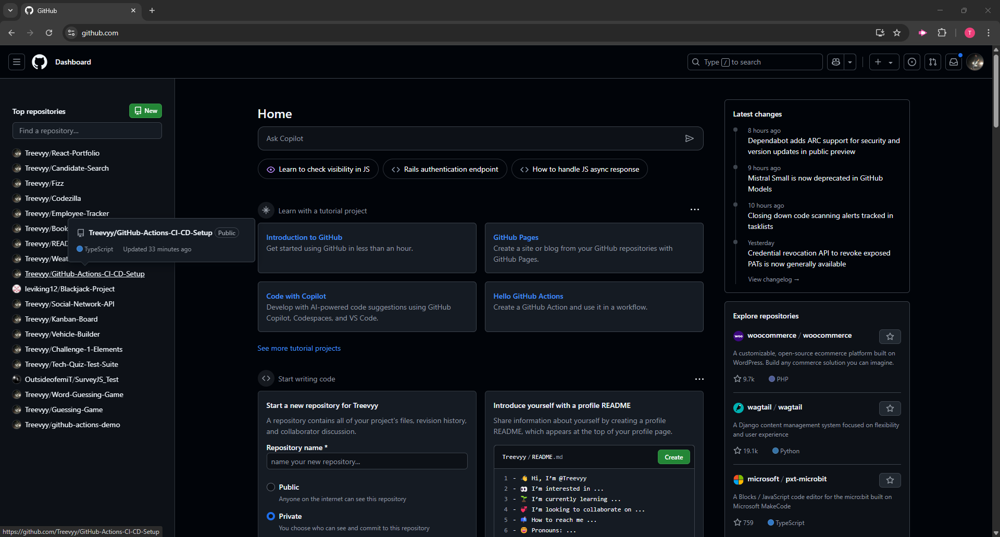
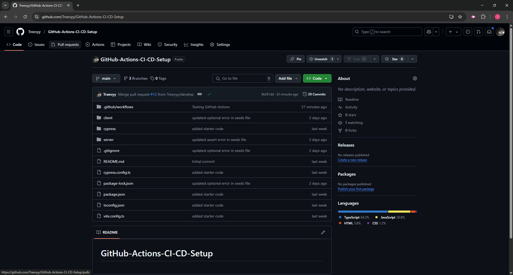
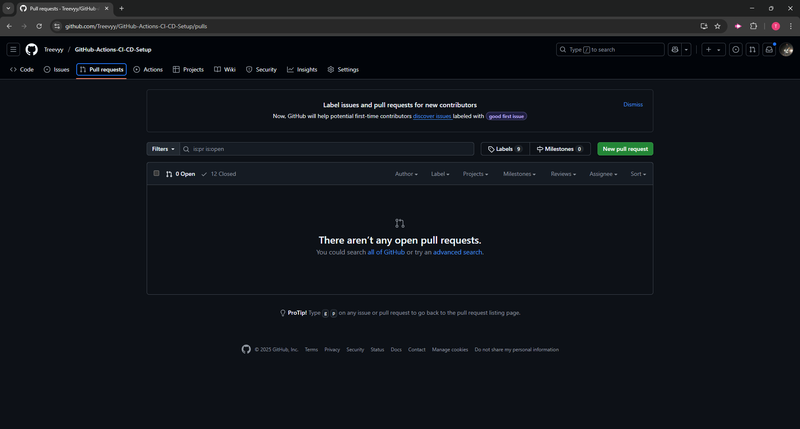
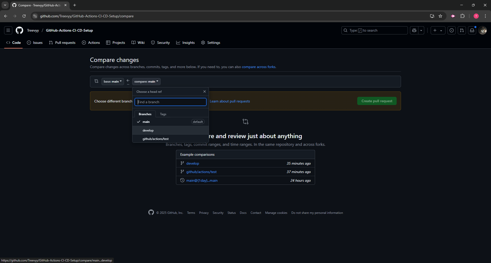
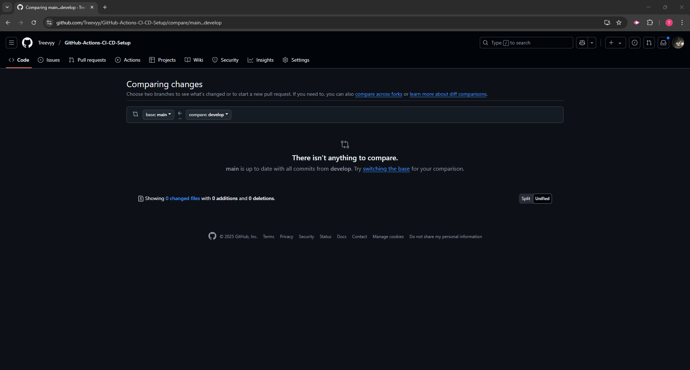
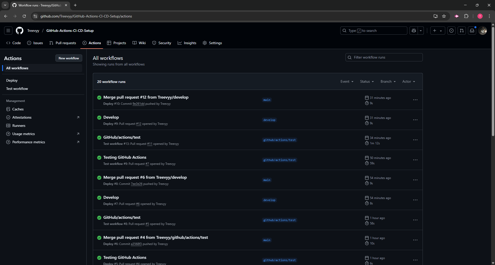
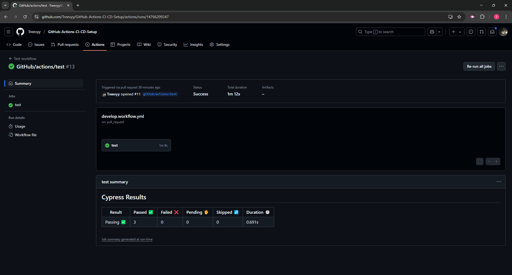
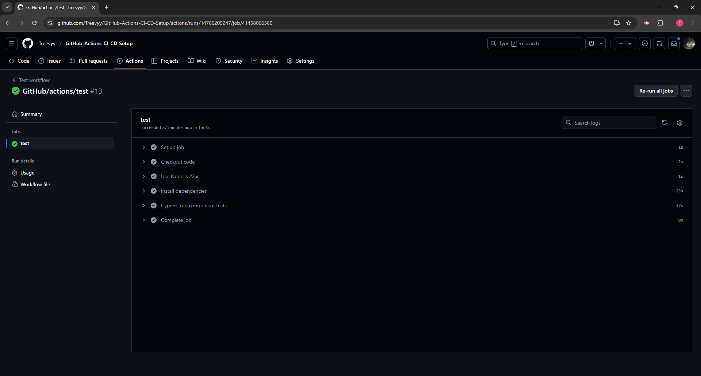

# GitHub-Actions-CI-CD-Setup

  ## Description
This project demonstrates a CI/CD pipeline integration for a full-stack MERN application using GitHub Actions, Cypress, and Render. The setup ensures clean and tested code through component testing on all pull requests to the develop branch, and automatic deployment to Render once merged into the main branch. This workflow aligns with industry standards for Continuous Integration and Continuous Deployment, providing a robust structure for team collaboration and automated delivery.

  ## Table of Contents
  - [Installation](#installation)
  - [Usage](#usage)
  - [Technologies](#technologies)
  - [Screenshots](#screenshots)
  - [Walkthrough Video](#walkthrough-video)
  - [URL Link](#url-link)
  - [Contributing](#contributing)
  - [Contributors](#contributors)
  - [Tests](#tests)
  - [License](#license)
  - [Questions](#questions)

  ## Installation
  
  1. Git clone: git@github.com:Treevyy/GitHub-Actions-CI-CD-Setup.git

  2. Navigate to the project directory: cd GitHub-Actions-CI-CD-Setup

  3. Right click the root package.json file and click open in integrated terminal

  4. Inside the terminal install the dependencies with the command: npm i

  5. After dependencies are installed run the application with the command: npm run build

  6. When your build is in the terminal run the command: npm run seed

  7. Once everything is seeded you can start the application with the command: npm run develop

  ## Usage
  To begin working with the CI/CD pipeline:

  1. Starting from main use the command: git checkout -b develop to create a feature branch and push changes to GitHub.

  2. In the develop branch either make a new branch or create changes here on the develop branch then when your changes are finished do the commands: 
        - git add .
        - git commit -m "write your changes here/and or whater you want"
        - git push

  3. After you push your changes go to go to GitHub and opoen your repo then go to the pull request tab, make sure you are change it from main to main -> develop to main now click create pull request.

  4. Confirm the pull request to start the GitHub actions test before merging the request.

  5. When the test are completed it will tell you if it passed or failed, if you passed you are good to merge if it failed revise your code till it passes.

  ## Technologies
 
### Frontend
  

  

  

  

### Backend
 

  

### Development and Testing Tools

  

  

  

  

  ## Screenshots
  
  

  

  

  

  

  

  

  
  

  ## Walkthrough Video
  A demo of the application can be found at the following link: https://drive.google.com/file/d/13M3UUT9ARd3Nw7q2rc_wEXY9IVbuxJ9V/view

  ## URL Link
  Here is the deployed link URL: https://github-actions-ci-cd-setup-28pr.onrender.com
  
  ## Contributing
  No contributions are needed for this project

  ## Contributors
  Thank you to all the TA's, Tutors and professor for all your help completeing this challenge

  1. Trevor Moore aka Treevyy

  2. Quentin Jones - TA

  3. Erik Hoversten - Tutor

  4. Justin Moore - Tutor

  5. Dan Mueller - Professor

  ## Tests
 To test GitHub Actions

 1. From main create a develop branch by opening your terminal, then use the command: git checkout -b develop

 2. From develop you can also create another branch so updates dont go directly to main buy also using the terminal and cheacking out a new branch, I did the command: git checkout -b github/actions/test

 3. Inside the new branch github/actions/test you can make your changes to your code then when you are ready to push your changes you will follow these three commands:
    - git add . 
    -  git commit -m "put your changes in a message here/ or anything you want to say here"
    -  git push

 4. After you push head over to GitHub and open your repo.

 5. In your repo got to pull request

 6. In pull request change the base to develop and the compare to github/action/test and or base to main and the compare to develop (depending if you pushed your changes to each branch)

 7. Now create the pull request

 8. Once the pull request is processing head over to the actions tab

 9. Inside the actions tab click the workflow action that is being tested (yellow dot means its currently running the test)

 10. Depending on if the test passes or fails will determine your next steps if it fails revide the code if it passes merge the pull request. 

 11. Lastly if needed repeate this process until everything is successfully merged to main. That can be straight from develop -> main or in my case it was github/action/test -> develop -> main.

  ## License
  This project is licensed under the MIT license.

  ## Questions
  If you have any additional questions, you can contact me at:
  - GitHub: [Treevyy](https://github.com/Treevyy)
  - Email: [aarontrevormoore@gmail.com](mailto:aarontrevormoore@gmail.com)
